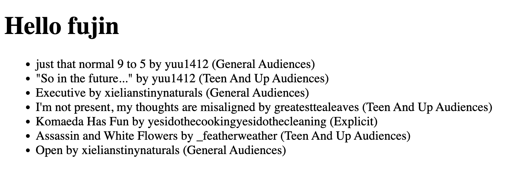

# ao3-content-layer

An example of using [@fujocoded/astro-ao3-loader](https://github.com/FujoWebDev/fujocoded-plugins/tree/main/astro-ao3-loader) with Astro.
You can find usage instruction in the plugin repo.
